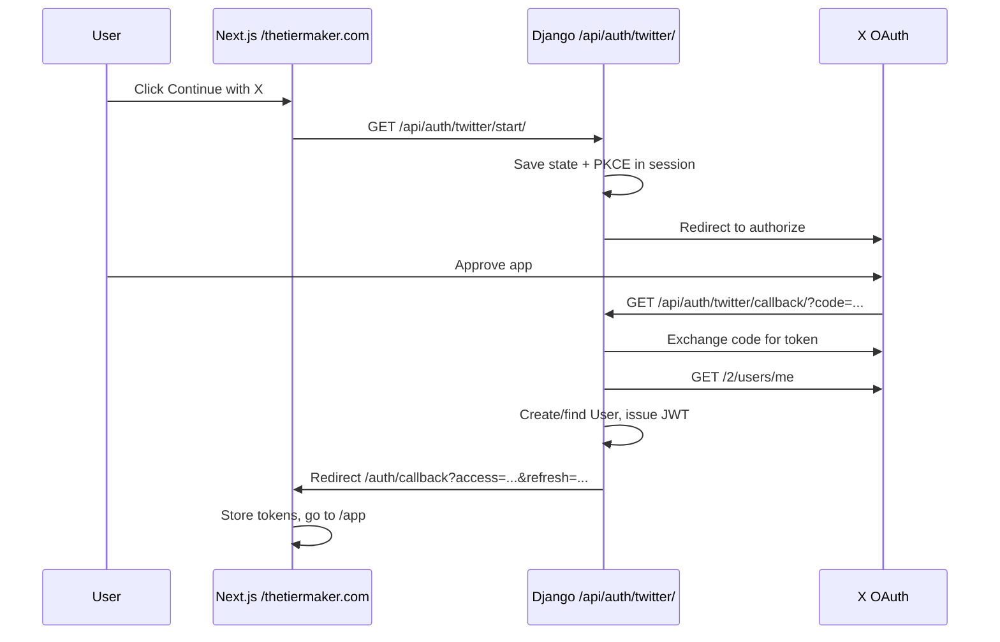

# X (Twitter) login setup for TierMaker

TierMaker supports **“Continue with X”** using **OAuth 2.0** with **PKCE**. Users sign in on X’s site; your backend creates or finds their account and issues **JWT** tokens (same as email login).

---

## How it works in this project



| URL | Purpose |
|-----|---------|
| `GET /api/auth/twitter/start/` | Starts OAuth (browser redirect) |
| `GET /api/auth/twitter/callback/` | X redirects here after approval |
| `/auth/callback` (Next.js) | Saves JWT and sends user into the app |

**Important:** The callback URL registered in the X portal must **exactly match** `TWITTER_CALLBACK_URL` in `.env` (including `https` and trailing slash).

For production with Next.js rewrites:

```env
TWITTER_CALLBACK_URL=https://thetiermaker.com/api/auth/twitter/callback/
```

---

## Part 1 — Create an X Developer account

### Step 1: Sign up for the developer portal

1. Open **[https://developer.x.com/](https://developer.x.com/)** (X Developer Platform).
2. Sign in with the X account that will **own** the app (often your brand account).
3. Complete **developer account onboarding** (use case, description, etc.).  
   - Choose a use case like **“Sign in with X”** / user authentication.  
   - Approval can be instant or take review time depending on account history.

### Step 2: Create a Project and App

1. In the developer portal, go to **Projects & Apps** (wording may vary).
2. **Create a Project** (e.g. name: `TierMaker Production`).
3. Inside the project, **add an App** (e.g. `TierMaker Web`).

You will need:

- **Client ID** (OAuth 2.0 Client ID) — public
- **Client Secret** — **secret**, never commit to git

---

## Part 2 — Configure OAuth 2.0 on the app

### Step 3: Enable OAuth 2.0

1. Open your **App** settings in the developer portal.
2. Find **User authentication settings** / **OAuth 2.0** and click **Set up** or **Edit**.
3. Enable **OAuth 2.0**.

### Step 4: App permissions (scopes)

Enable at least:

| Setting | Value |
|--------|--------|
| **Type of App** | Web App (confidential client) |
| **App permissions** | Read (minimum for sign-in) |

Requested scopes in code (default in `settings.py`):

```text
users.read tweet.read offline.access
```

- **users.read** — read profile (`/2/users/me`) for login  
- **tweet.read** — often required with read-only apps  
- **offline.access** — optional refresh token from X (not required for our JWT flow)

You can narrow scopes in `.env` with `TWITTER_OAUTH_SCOPES` if the portal allows fewer.

### Step 5: Callback URL / Redirect URI

Add **every** environment you use:

| Environment | Callback URL |
|-------------|----------------|
| Local (Next on :3000, API proxied) | `http://localhost:3000/api/auth/twitter/callback/` |
| Production | `https://thetiermaker.com/api/auth/twitter/callback/` |

Rules:

- Must match **character-for-character** what Django uses (`TWITTER_CALLBACK_URL`).
- Use **https** in production.
- Trailing slash: this project’s API paths use a trailing slash (`/callback/`).

### Step 6: Website URL

Set **Website URL** to your site root, e.g.:

- `https://thetiermaker.com`
- `http://localhost:3000` (dev)

### Step 7: Copy Client ID and Client Secret

From the app’s **Keys and tokens** / **OAuth 2.0** section:

1. Copy **OAuth 2.0 Client ID** → `TWITTER_CLIENT_ID`
2. Copy **OAuth 2.0 Client Secret** → `TWITTER_CLIENT_SECRET`  
   - Regenerate if exposed; update `.env` immediately.

---

## Part 3 — Configure TierMaker (backend)

### Step 8: `.env` variables

On the server (e.g. `/var/www/Tiermaker/.env`):

```env
FRONTEND_URL=https://thetiermaker.com

TWITTER_CLIENT_ID=your_oauth2_client_id_here
TWITTER_CLIENT_SECRET=your_oauth2_client_secret_here
TWITTER_CALLBACK_URL=https://thetiermaker.com/api/auth/twitter/callback/
```

Local development:

```env
FRONTEND_URL=http://localhost:3000
TWITTER_CLIENT_ID=...
TWITTER_CLIENT_SECRET=...
TWITTER_CALLBACK_URL=http://localhost:3000/api/auth/twitter/callback/
```

Optional:

```env
TWITTER_OAUTH_SCOPES=users.read tweet.read offline.access
TWITTER_OAUTH_EMAIL_DOMAIN=oauth.thetiermaker.local
```

### Step 9: Database migration

```bash
source .venv/bin/activate
python manage.py migrate accounts
```

Adds `twitter_id` and `x_username` on the User model.

### Step 10: Restart services

```bash
sudo systemctl restart tiermaking-backend
# and your Next.js / PM2 / systemd service for the frontend
```

### Step 11: Test the flow

1. Open `https://thetiermaker.com/login` (or local login).
2. Click **Continue with X**.
3. Approve on X.
4. You should land in the app, signed in.

Check backend logs if redirect fails.

---

## Part 4 — User accounts created via X

- Users get an internal email like `x_<twitter_id>@oauth.thetiermaker.local` (not shown as a real inbox).
- **Password is unset** — they sign in with X only unless you add “set password” later.
- **`x_username`** stores their X handle when available.
- **`twitter_id`** links the X account (unique).

---

## Part 5 — Security checklist

- [ ] Never commit `TWITTER_CLIENT_SECRET` to git (`.env` only).
- [ ] Use **HTTPS** in production for `FRONTEND_URL` and callback URL.
- [ ] Callback URL in X portal matches `TWITTER_CALLBACK_URL` exactly.
- [ ] `ALLOWED_HOSTS` includes your production domain.
- [ ] `DEBUG=False` in production (enables secure session cookies).
- [ ] Rotate client secret if leaked.

---

## Troubleshooting

### “X login is not configured on the server”

`TWITTER_CLIENT_ID`, `TWITTER_CLIENT_SECRET`, or `TWITTER_CALLBACK_URL` is missing in `.env`. Restart Django after editing.

### Redirect URI mismatch

X shows an error about redirect URI. Fix:

1. Portal callback list includes exact `TWITTER_CALLBACK_URL`.
2. No `http` vs `https` typo, no missing trailing slash.

### “Sign-in failed” / invalid state

- Session cookie blocked (third-party cookies rare here; same-site flow should work).
- User took too long on X page (session expired) — try again.
- Started OAuth on one domain, callback on another (e.g. `www` vs non-`www`).

Use one canonical host (always `https://thetiermaker.com`).

### Works locally but not production

- Production callback not added in X portal.
- Nginx not proxying `/api/auth/twitter/` to Django.
- `FRONTEND_URL` still set to `localhost`.

### Email scope / real email from X

This integration does **not** require the `users.email` scope. Real email from X needs extra portal approval; we use synthetic emails for account identity.

---

## API reference (for developers)

| Endpoint | Method | Auth |
|----------|--------|------|
| `/api/auth/twitter/start/` | GET | Public — redirects to X |
| `/api/auth/twitter/callback/` | GET | Public — X redirect target |

Query params for **start**:

- `next` — optional path after login (e.g. `/app/lists/new`), must start with `/`.

Frontend callback page: **`/auth/callback`** (reads `access`, `refresh`, `next` query params).

---

## Related files

| File | Role |
|------|------|
| `accounts/twitter_oauth.py` | PKCE, token exchange, profile fetch |
| `accounts/twitter_views.py` | Start + callback views |
| `accounts/models.py` | `twitter_id`, `x_username` |
| `web/components/TwitterLoginButton.tsx` | Login / register button |
| `web/app/auth/callback/page.tsx` | Stores JWT after OAuth |

See also: [README.md](../README.md), [EC2_DEPLOYMENT_GUIDE.md](../EC2_DEPLOYMENT_GUIDE.md) if present.
